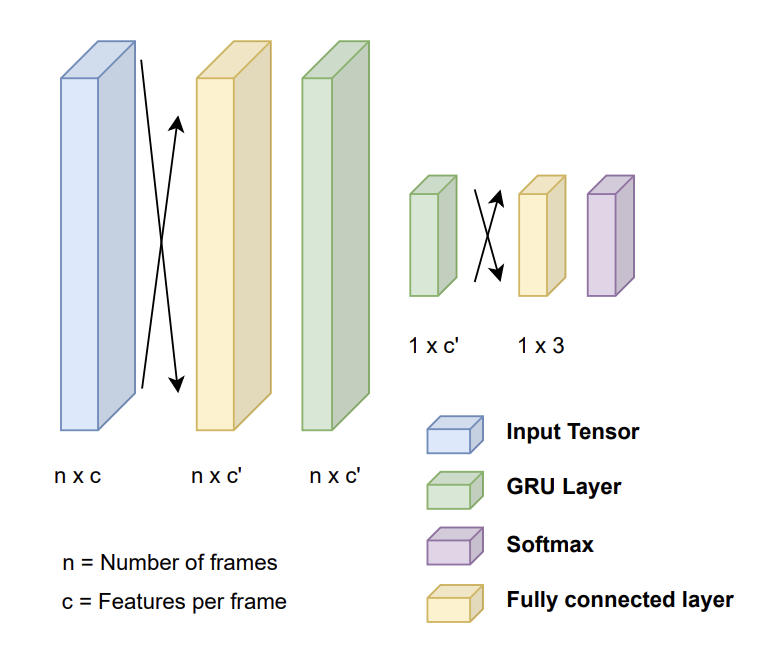

# Model Results

## HitDetect
### Model architecture
Architecture of our hit detection model is based on a
simple GRU-based recurrent network that consumes court, pose, and
2D shuttlecock information to make hit predictions

ref: [MonoTrack: Shuttle trajectory reconstruction from monocular badminton video](https://arxiv.org/pdf/2204.01899v2.pdf)
### Results

| Appoarches | Accuracy | F1 | Precision | Recall |
|---|---|---|---|---|
|Before optimization|0.556|0.315|0.374|**0.677**|
|After optimization|0.937|0.469|0.469|0.471|
|After optimization (tolerance=1)|0.979|0.570|0.654|0.526|
|After Before optimization (tolerance=3)|**0.989**|**0.697**|**0.735**|0.672|